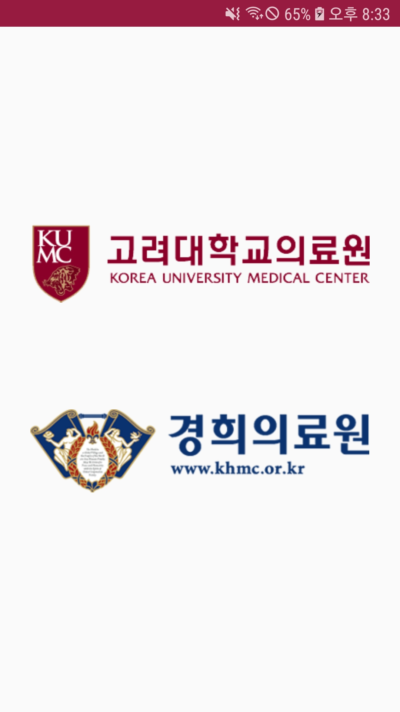
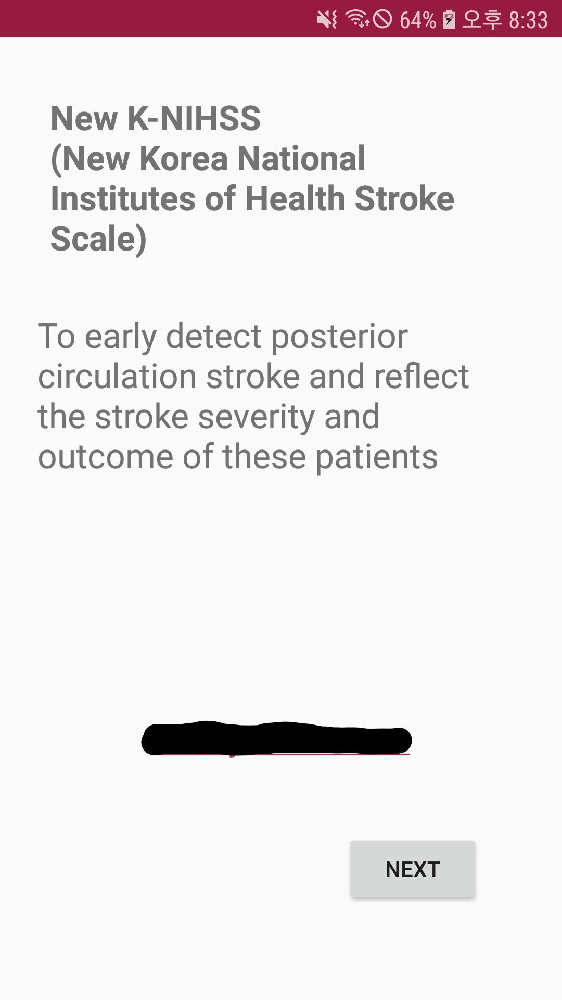
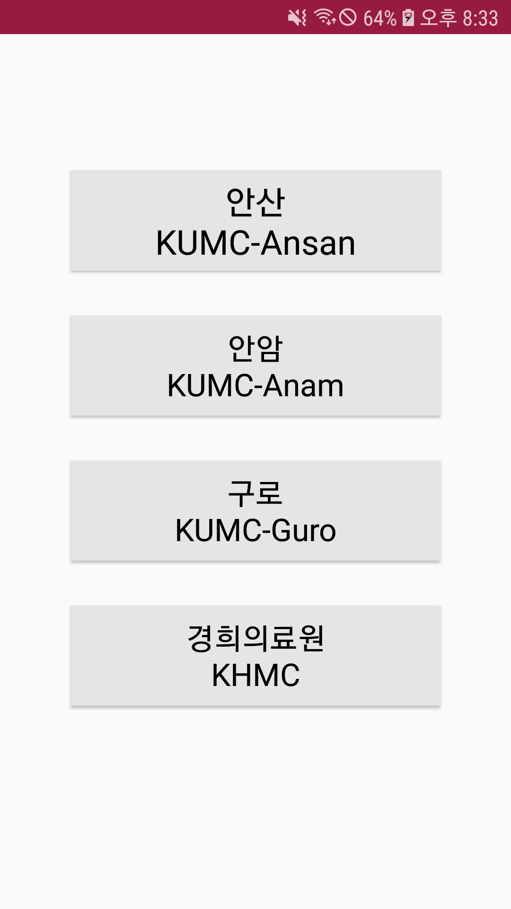
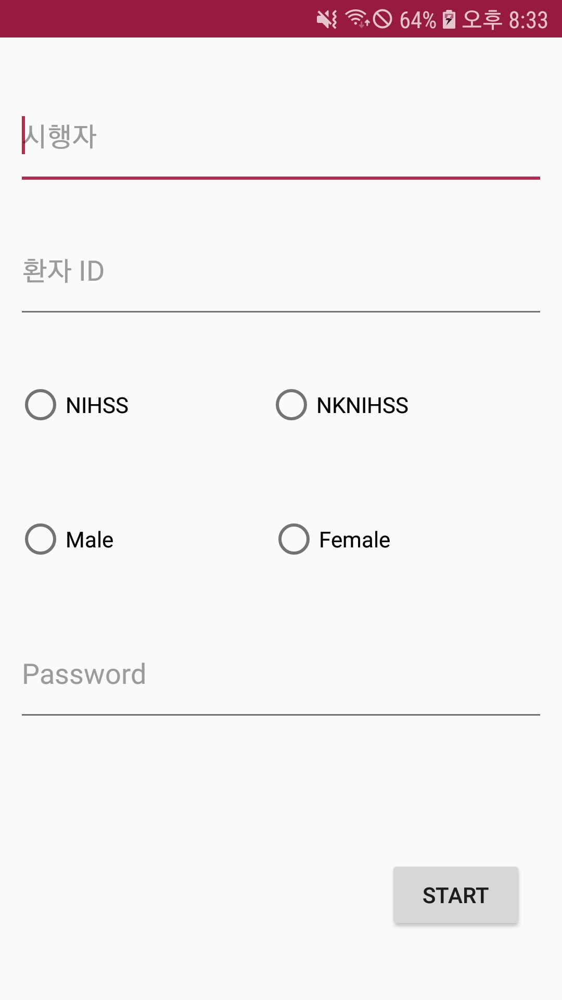
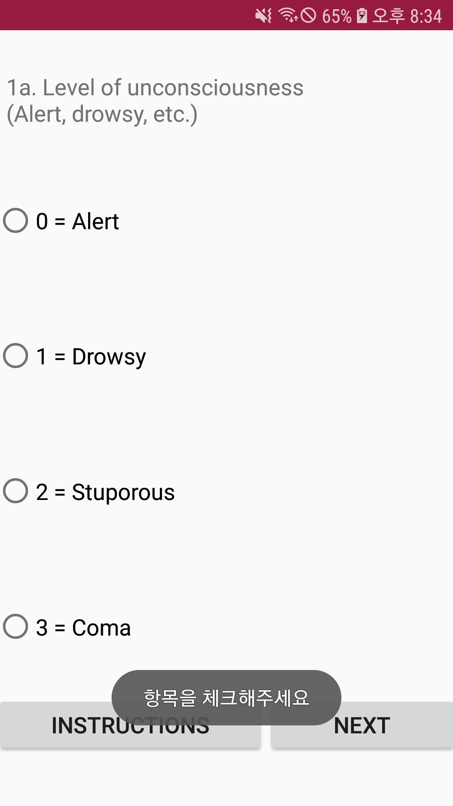
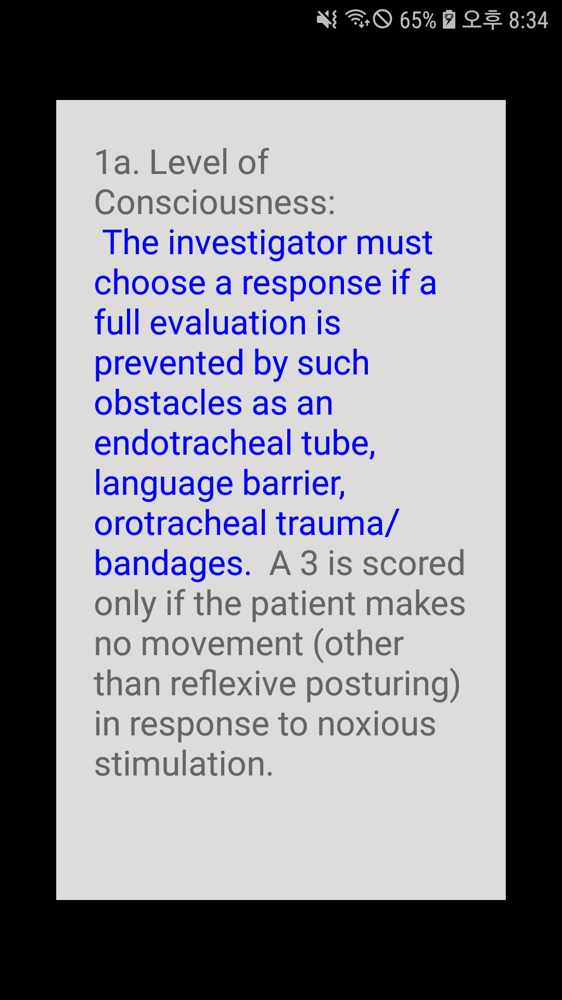

# N-KNIHSS

New - Korean version of National Institutes of Health Stroke Scale Android Application

- 목표:  안드로이드 어플을 통해 new- K NIHSS 검사를 하고 AWS를 활용하여 데이터베이스화하자.
- 제작 기간: 2개월
- Keyword: Android, Nodejs, AWS EC2, RDS, MySQL, REST API

### 샘플 화면

---

    

    

## LICENSE

This is released under the MIT license. See [LICENSE](LICENSE) for details.

